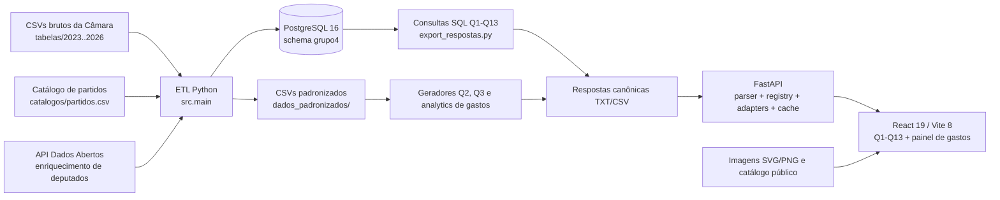

# BDR — documentação técnica e estado atual

> Levantamento realizado em 19/06/2026 sobre o conteúdo disponível localmente no branch `Caio#2`, commit `5c6f9dd` (`refac: refatorando questoes por pastas e blocos`).
>
> Este documento combina inspeção do código, configuração, dados, artefatos, testes, histórico Git e registros de auditoria. Quando algo é inferência ou registro histórico potencialmente desatualizado, isso é indicado explicitamente.

## 1. Resumo executivo

O projeto BDR consolida dados abertos da Câmara dos Deputados referentes à 57ª Legislatura e ao período de 2023 a 2026. O sistema possui quatro partes principais:

1. Um ETL em Python que lê CSVs brutos da Câmara, normaliza tipos e entidades, limita o universo à 57ª Legislatura, produz CSVs padronizados e carrega PostgreSQL.
2. Um conjunto de consultas SQL e geradores de artefatos que respondem às questões Q1–Q13.
3. Uma API FastAPI que não consulta o PostgreSQL durante a navegação: ela lê os arquivos de resposta já exportados, aplica adapters, filtros, ordenação e paginação e entrega um contrato JSON uniforme.
4. Um frontend React/Vite com páginas individuais para Q1–Q13 e um painel consolidado de gastos com seis abas analíticas.

O projeto está funcional e com testes automatizados relevantes. Na verificação deste levantamento:

- 18 testes Python da raiz passaram;
- 24 testes do backend passaram;
- 12 testes do frontend passaram;
- o build de produção passou;
- o lint do frontend falhou com 24 erros e 1 aviso;
- o build avisou que o chunk JavaScript principal, com aproximadamente 1,47 MB minificado e 475 KB gzip, excede o limite recomendado de 500 KB;
- o Docker Desktop não estava ativo, portanto o PostgreSQL e os fluxos dependentes dele não foram reexecutados nesta data;
- todos os arquivos canônicos registrados para Q1–Q13 existem no workspace;
- o worktree estava limpo antes da criação deste documento.

O maior risco funcional atual não é a interface: é a confiabilidade e a reprodutibilidade dos dados. Existem auditorias que encontraram divergências entre CSVs locais e a API oficial, especialmente em gastos, além de uma auditoria histórica que detectou arquivos incompletos de 2024 e 2025. Parte desses problemas foi corrigida por novos downloads e regeneração dos artefatos, mas a reconciliação de gastos ainda está explicitamente pendente.

## 2. Estado do repositório e branches

### 2.1 Branch atual

- Branch local: `Caio#2`.
- HEAD: `5c6f9dd`.
- Remoto correspondente: `origin/Caio#2`, no mesmo commit.
- `origin/development` está um commit à frente apenas por um merge commit (`4bfe5aa`, merge do próprio `Caio#2`). Em conteúdo, a linha de desenvolvimento incorpora esta refatoração.
- O branch atual está 57 commits à frente de `origin/master`.
- Não existem tags/releases Git.
- Remoto: `https://github.com/cocaioo/bdr-final.git`.
- Há aproximadamente 1.898 arquivos rastreados pelo Git.

### 2.2 Última grande refatoração

O commit `5c6f9dd`, de 18/06/2026, reorganizou as questões por domínio e eliminou duplicações antigas espalhadas por `Banco/respostas`, `respostas`, `Cirilo`, `Vinicius`, `Caio/q*`, `JF/q*` e `artifacts/q*`.

A estrutura canônica passou a ser:

- `Caio/gastos-fornecedores/`: Q1, Q5, Q7, Q12 e Q13;
- `Caio/escolaridade-perfil/`: Q4 e Q6;
- `JF/producao-legislativa-temas/`: Q2, Q3 e Q8;
- `JF/partidos-ideologia-votacao/`: Q9, Q10 e Q11.

O `question_registry.json`, os scripts, os testes e os caminhos de exportação foram atualizados para apontar para essas pastas. Essa reorganização é o estado arquitetural vigente.

## 3. Arquitetura geral



### Decisão arquitetural central

O dashboard não consulta o banco diretamente. O PostgreSQL é usado para ETL, validação e geração das respostas. Em tempo de navegação, o backend lê arquivos TXT/CSV canônicos do repositório e, no módulo de gastos, artefatos analíticos locais.

Consequências:

- o dashboard pode operar sem PostgreSQL depois que os artefatos foram gerados;
- os resultados são reproduzíveis e auditáveis por arquivo;
- alterações no banco não aparecem no dashboard até nova exportação;
- arquivos muito grandes são lidos e parseados no processo da API;
- um clone novo precisa gerar os analytics de gastos, pois esses arquivos estão ignorados pelo Git;
- o conteúdo exibido é tão atual quanto a última execução do ETL/exportação.

## 4. Estrutura de diretórios

| Caminho | Responsabilidade atual |
|---|---|
| `src/` | ETL, limpeza, carga PostgreSQL, enriquecimento pela API, auditoria e exportação de respostas. |
| `tabelas/` | 41 CSVs brutos, separados por 2023–2026, mais `deputados.csv`; cerca de 963 MB. |
| `dados_padronizados/` | 12 CSVs normalizados; cerca de 327 MB e 2.613.428 linhas de dados. |
| `catalogos/` | Catálogo canônico de partidos ativos e históricos, com ideologia. |
| `Banco/` | Compose do PostgreSQL/pgAdmin e schema inicial. |
| `Caio/` | Questões de gastos/fornecedores e escolaridade/perfil. |
| `JF/` | Questões de produção legislativa/temas e partidos/ideologia. |
| `dashboard/backend/` | API FastAPI, modelos Pydantic, adapters, parser, cache e testes. |
| `dashboard/frontend/` | SPA React/Vite, estilos, componentes, testes Vitest e testes Playwright. |
| `dashboard/scripts/` | Geração de Q2, normalização de Q3, nuvens de Q11, analytics e auditoria de gastos. |
| `tests/` | Contratos do ETL, Q3, analytics de gastos e auditoria da API. |
| `logs/` | Logs locais, cache da API, manifest do ETL e linhas rejeitadas; ignorado pelo Git. |
| `scratch/` | Staging e scripts exploratórios locais; ignorado pelo Git. |
| `artifacts/` | Atualmente contém referências visuais de UX (`ux-home.png` e `ux-q1.png`). |
| `docs/pdfs/` | Dossiê, perguntas e relatório em PDF. |

## 5. Stack atual

### 5.1 Linguagens e runtime

| Área | Tecnologia | Configuração declarada | Versão instalada verificada |
|---|---|---:|---:|
| ETL/backend | Python | README: 3.11+ | 3.13.1 |
| Banco | PostgreSQL | imagem Docker `postgres:16` | não verificado em execução |
| Administração | pgAdmin | imagem `dpage/pgadmin4:8` | não verificado em execução |
| Frontend | Node.js | README: 20+ | ambiente local disponível |
| Frontend | npm | package lock | ambiente local disponível |
| Scripts operacionais | PowerShell/Make | Windows | usado no workspace |

### 5.2 Python

Dependências declaradas na raiz:

- `pandas>=2.0`: leitura, limpeza, junção, agregação e escrita de CSVs;
- `psycopg2-binary>=2.9`: conexão e `COPY` no PostgreSQL;
- `python-dotenv>=1.0`: leitura do `.env`.

Dependências declaradas no backend:

- `fastapi>=0.115,<1`;
- `uvicorn[standard]>=0.30,<1`;
- `pydantic>=2.7,<3`;
- `pytest>=8,<9`;
- `httpx>=0.27,<1`;
- `wordcloud>=1.9,<2`.

Versões instaladas verificadas:

- pandas 2.2.3;
- psycopg2-binary 2.9.12;
- python-dotenv 1.0.1;
- FastAPI 0.136.3;
- Uvicorn 0.48.0;
- Pydantic 2.13.4;
- pytest 8.4.2;
- httpx 0.28.1;
- wordcloud 1.9.6.

Observações:

- as versões Python usam intervalos, não um lockfile;
- bibliotecas de teste estão no mesmo `requirements.txt` do backend de runtime;
- o README fala em Python 3.11+, mas o ambiente atual já está em 3.13.1 e os testes passam nele.

### 5.3 Frontend

Dependências de runtime instaladas:

- React 19.2.6 e React DOM 19.2.6;
- React Router DOM 7.15.1;
- ECharts 6.1.0;
- TanStack React Table 8.21.3.

Ferramentas instaladas:

- TypeScript 6.0.3;
- Vite 8.0.14 e plugin React 6.0.2;
- Vitest 4.1.7;
- Playwright 1.60.0;
- Testing Library React 16.3.2, user-event 14.6.1 e jest-dom 6.9.1;
- ESLint 10.4.0 e plugins de hooks/refresh;
- jsdom 27.4.0.

O frontend não utiliza framework CSS nem biblioteca pronta de componentes. O design é mantido em CSS global, principalmente em `src/index.css` (aproximadamente 3.006 linhas) e `src/visual-refresh.css`.

## 6. Dados brutos e dados padronizados

### 6.1 Universo

O ETL trabalha com dados de 2023 a 2026 e restringe entidades parlamentares à 57ª Legislatura, correspondente a 01/02/2023–31/01/2027.

Regras relevantes:

- deputados: somente registros com `id_legislatura_final = 57`;
- gastos: `codLegislatura = 57`, quando a coluna existe no bruto;
- votações e eventos: datas anteriores a 01/02/2023 são removidas;
- tabelas filhas são filtradas pelos IDs válidos já gravados nos CSVs padronizados;
- registros de liderança, com nomes iniciados por `LID.` ou `LIDERANCA`, são removidos dos gastos;
- chaves duplicadas são removidas mantendo a primeira ocorrência;
- campos obrigatórios nulos removem a linha e geram amostra em `logs/bad_rows_*`;
- tipos numéricos inválidos são auditados antes da carga.

### 6.2 Volume atual dos CSVs padronizados

Valores extraídos do workspace e do último `etl_load_manifest.csv`, gerado em 09/06/2026:

| Dataset | Linhas | Tamanho aproximado | Observação |
|---|---:|---:|---|
| `deputados.csv` | 640 | 0,08 MB | Cadastro final da 57ª Legislatura, enriquecido. |
| `partidos_ideologia.csv` | 21 | mínimo | Partidos ativos com ideologia. |
| `proposicoes.csv` | 260.758 | 67,07 MB | Proposições 2023–2026. |
| `eventos.csv` | 9.971 | 5,60 MB | Eventos após o corte temporal. |
| `votacoes.csv` | 34.142 | 3,01 MB | Votações após o corte temporal. |
| `gastos.csv` | 720.937 | 87,64 MB | Gastos válidos da legislatura. |
| `votacoes_votos.csv` | 462.742 | 22,62 MB | Um voto por ano/votação/deputado. |
| `votacoes_orientacoes.csv` | 15.148 | 2,09 MB | Orientações de bancadas. |
| `votacoes_objetos.csv` | 219.399 | 53,58 MB | Objetos/proposições associados a votações. |
| `proposicoes_temas.csv` | 101.929 | 9,65 MB | Temas por URI de proposição. |
| `eventos_presenca_deputados.csv` | 336.547 | 7,02 MB | Presenças em eventos. |
| `proposicoes_autores.csv` | 451.194 | 53,70 MB | Autores e pesos de autoria. |
| **Total** | **2.613.428** | **~327 MB** | 12 datasets. |

### 6.3 Manifest do último ETL

O último manifest registra carga bem-sucedida das 12 tabelas. Reduções importantes entre bruto e limpo:

- deputados: 7.884 linhas brutas para 640 deputados da 57ª Legislatura;
- votações: 40.064 para 34.142;
- gastos: 737.298 para 720.937;
- votos: 463.180 para 462.742;
- objetos de votação: 244.669 para 219.399;
- autores: 453.902 para 451.194.

Nenhuma linha malformada foi registrada no manifest mais recente, embora existam logs históricos de campos obrigatórios ausentes em gastos e votos.

## 7. ETL em Python

### 7.1 Orquestração (`src/main.py`)

O pipeline:

1. carrega `.env`;
2. cria diretórios de saída;
3. configura log em arquivo e console;
4. conecta ao PostgreSQL e ajusta `search_path`;
5. executa `TRUNCATE ... RESTART IDENTITY CASCADE` em todas as tabelas;
6. percorre `LOAD_ORDER` respeitando dependências;
7. lê, padroniza, salva CSV limpo e usa `COPY` para carregar cada tabela;
8. continua nas tabelas seguintes mesmo se uma delas falhar;
9. grava `logs/etl_load_manifest.csv`;
10. imprime resumo de contagens e duração.

A ordem é: deputados, partidos, proposições, eventos, votações, gastos, votos, orientações, objetos, temas, presenças e autores.

### 7.2 Leitura robusta (`src/utils.py`)

- busca arquivos recursivamente em `tabelas/`;
- extrai o ano do nome ou caminho;
- ignora arquivos ocultos e temporários;
- lê tudo inicialmente como string;
- tenta UTF-8, UTF-8 com BOM e, por fim, Latin-1;
- usa o engine Python do pandas e pode coletar linhas inválidas;
- escreve CSVs UTF-8, separados por `;`, com `\n`.

### 7.3 Limpeza (`src/cleaning.py`)

Existem funções puras para:

- nulos e espaços;
- uppercase e remoção de acentos;
- aliases de partidos;
- normalização de votos (`Sim`, `Nao`, `Abstencao`, `Obstrucao`, `Artigo 17`, `Liberado`);
- inteiros e decimais em formato brasileiro/americano;
- dinheiro com duas casas;
- CPF com 11 dígitos;
- data, timestamp e booleano;
- extração de ID da URI da Câmara;
- truncamento de textos para limites do banco.

### 7.4 Enriquecimento de deputados (`src/enrichment.py`)

O cadastro de deputados pode ser enriquecido pela API `https://dadosabertos.camara.leg.br/api/v2/deputados/{id}`.

- preenche CPF, nome civil e escolaridade quando ausentes;
- usa `ThreadPoolExecutor`, padrão de oito workers;
- timeout de 12 segundos;
- usa cache JSON em `logs/deputados_api_cache.json`;
- falhas individuais são guardadas no cache como erro e não derrubam o ETL;
- pode ser desativado por `ENRICH_DEPUTADOS_API=false`.

### 7.5 Catálogo de partidos

`catalogos/partidos.csv` é a fonte canônica compartilhada. Há 21 partidos ativos e cinco históricos. Apenas ativos com ideologia são carregados em `partidos_ideologia` e expostos no filtro global. Aliases como `REPUBLIC` → `REPUBLICANOS`, `SOLIDARI` → `SOLIDARIEDADE` e `PCDOB.` → `PCDOB` são normalizados.

### 7.6 Carga no banco (`src/db.py`)

- conexão via psycopg2;
- nomes de schema/tabela/coluna são compostos com `psycopg2.sql`;
- carga usa `COPY FROM STDIN`, CSV com cabeçalho, delimitador `;` e vazio como `NULL`;
- cada tabela é commitada isoladamente.

## 8. Banco de dados

### 8.1 Infraestrutura

O `Banco/docker-compose.yml` cria:

- PostgreSQL 16, container `bdr-postgres`, banco `dossie_grupo4`, exposto por padrão em `localhost:5433`;
- pgAdmin 4 versão 8, container `bdr-pgadmin`, em `localhost:5050`;
- volumes persistentes para banco e pgAdmin;
- montagem de `init.sql`, `Banco/sql` e `scratch/query-staging`.

Há também `docker-compose.pgadmin.yml`, que sobe outro pgAdmin (`pgadmin-grupo4`) na mesma porta 5050. Os dois arquivos não devem ser usados simultaneamente sem alterar porta/container/volume.

Credenciais padrão de desenvolvimento são `admin/admin`; o pgAdmin usa `admin@example.com/admin`. Isso é aceitável apenas em ambiente local.

### 8.2 Schema `grupo4`

O `init.sql` recria o schema e define 12 tabelas:

| Tabela | Chave principal | Papel |
|---|---|---|
| `deputados` | `id_deputado` | Cadastro parlamentar. |
| `partidos_ideologia` | `sigla_partido` | Classificação ideológica. |
| `proposicoes` | `(ano_dados, id_proposicao)` | Proposições e ementas. |
| `eventos` | `(ano_dados, id_evento)` | Eventos legislativos. |
| `votacoes` | `(ano_dados, id_votacao)` | Votações. |
| `gastos` | `id_gasto` identity | Despesas CEAP. |
| `votacoes_votos` | `(ano_dados, id_votacao, id_deputado)` | Votos nominais. |
| `votacoes_orientacoes` | `(ano_dados, id_votacao, sigla_bancada)` | Orientações partidárias. |
| `votacoes_objetos` | `id_votacao_objeto` identity | Matérias ligadas às votações. |
| `proposicoes_temas` | `(ano_dados, uri_proposicao, cod_tema)` | Temas. |
| `eventos_presenca_deputados` | `(ano_dados, id_evento, id_deputado)` | Presenças. |
| `proposicoes_autores` | `id_autoria` identity | Autorias. |

Existem 12 índices de apoio para ano, deputado, partido, UF, votação e proposição.

Há nove views de conveniência para 2026: proposições, eventos, votações, gastos, votos, orientações, objetos, temas e presenças.

### 8.3 Integridade e limitações do schema

Há foreign keys explícitas de gastos, votos e presenças para deputados. Algumas relações naturais não têm FK declarada, por exemplo:

- votos/orientações/objetos para `votacoes`;
- objetos/temas/autores para `proposicoes`;
- partidos observados para `partidos_ideologia`.

Isso deixa parte da integridade a cargo do ETL. O ETL efetivamente filtra filhos pelos pais padronizados, mas o banco sozinho não impede todas as inconsistências.

O `init.sql` só roda automaticamente quando o volume do PostgreSQL é criado. Alterar o arquivo não migra um volume existente; é necessário recriar o volume ou adotar migrações.

## 9. Geração e exportação das respostas

### 9.1 Fluxo SQL

`src/export_respostas.py`:

1. limpa `scratch/query-staging`;
2. executa 14 arquivos SQL dentro do container `bdr-postgres` via `docker exec -i ... psql`;
3. força `search_path=grupo4` e client encoding UTF-8;
4. executa o gerador local da Q2 com `--all`;
5. copia os TXT/CSV produzidos para as pastas canônicas das questões.

Q2 não está na lista SQL do exportador porque seu gerador Python produz os artefatos diretamente a partir dos CSVs padronizados.

O exportador também espera um `q9_vies_deputado_detalhe.csv`, ignorado pelo Git para não versionar o dump analítico enorme.

### 9.2 Formato dos artefatos

As respostas tradicionais são saídas tabulares do psql em TXT. O parser do backend reconhece:

- título anterior à tabela;
- cabeçalho separado por `|`;
- linha separadora `---+---`;
- marcador `(N rows)`;
- números inteiros e decimais.

Q3 usa CSVs `;` normalizados. O backend escolhe o parser pela extensão.

### 9.3 Tamanho dos artefatos registrados

Todos existem no workspace. Tamanho somado por questão:

| Questão | Arquivos | Tamanho aproximado |
|---|---:|---:|
| Q1 | 1 | 0,07 MB |
| Q2 | 2 | 19,95 MB |
| Q3 | 3 | 49,53 MB |
| Q4 | 2 | 0,04 MB |
| Q5 | 2 | 0,09 MB |
| Q6 | 7 | 0,02 MB |
| Q7 | 2 | 0,50 MB |
| Q8 | 3 | 0,59 MB |
| Q9 | 1 | 0,88 MB |
| Q10 | 1 | 0,12 MB |
| Q11 | 1 | 0,04 MB |
| Q12 | 2 | 66,52 MB |
| Q13 | 2 | 4,59 MB |

Q12 é o maior custo de parsing entre as respostas tradicionais. Há teste que impede rastrear arquivos individuais acima do limite de 100 MB do GitHub.

## 10. Implementação das questões Q1–Q13

O `dashboard/backend/app/question_registry.json` é a fonte única de metadados: título, grupo, tags, arquivos, SQL, tipo de gráfico, filtros, colunas esperadas, explicação e mapeamento de campos.

### Q1 — Gastos por deputado

- Grupo: gastos.
- Agrega `valor_liquido` por deputado.
- Prefere `nome_civil` como rótulo, com fallback para nome parlamentar.
- Ordena do maior para o menor gasto.
- Filtros: partido, UF e deputado.
- Visual: barras horizontais com Top 15.
- Cards: gasto total, média por deputado, maior gasto individual e quantidade de deputados.
- Contratos garantem rótulo civil e ordem descendente.

### Q2 — Eixos e nuvens de palavras

- Grupo: produção legislativa.
- Consolida autorias por deputado, ano e tema.
- Expõe quantidade de proposições e proposições aprovadas.
- Gera nuvens anuais e consolidada em PNG/SVG, além de CSV/JSON de contagens.
- Período atual: 2023, 2024, 2025 e 2026.
- Filtros: eixo, deputado e ano; o shell esconde o filtro de deputado nesta página, mas o backend o suporta.
- Ao não selecionar ano, o adapter agrega as linhas dos anos.
- O frontend exibe SVGs locais. A antiga interação por clique está temporariamente desativada no `WordCloudGrid`, apesar de os props de clique ainda existirem.

### Q3 — Votos por eixo principal

- Grupo: produção legislativa.
- Foi completamente normalizada para evitar duplicação de votos causada pelo relacionamento muitos-para-muitos entre votação e objetos.
- Unidade estatística: `(ano_dados, id_votacao, id_deputado)`.
- Três artefatos: resumos agregados, votos mínimos e classificação das votações.
- Filtros: ano, eixo principal e deputado.
- Sem deputado selecionado, o backend não carrega o CSV de votos e devolve estado orientando a seleção. Isso reduz custo de memória/latência.
- Com deputado selecionado, entrega gráfico de distribuição, donut, cards e tabela de votos enriquecida com matéria/ementa.
- O filtro tem catálogo específico com IDs como valor e nome público como label.
- Classificador textual versão `q3_textual_v1`, eixos `EIXOS_Q3_V1` e pesos por fonte textual.
- Manifest atual: 462.742 votos únicos, zero duplicidades, 1.566 votações classificadas, 86,61% dos votos com eixo e 61.973 votos em “Sem classificação”.
- Auditoria qualitativa considerou as amostras plausíveis, mas aponta tendência do eixo “Institucional e jurídico” absorver textos procedimentais/jurídicos frequentes.

### Q4 — Escolaridade da 57ª Legislatura

- Grupo: perfil.
- Conta deputados únicos por escolaridade; nulos/vazios viram “Nao informado”.
- Filtros: partido e escolaridade.
- O filtro de deputado foi removido por não combinar com a agregação da questão.
- Adapter específico entrega visões por escolaridade e por partido, com comportamento de filtro deliberadamente diferente entre gráfico e tabela.
- O frontend esconde cards puramente de contagem considerados pouco úteis para essa apresentação.

### Q5 — Fornecedores com maior total pago

- Grupo: gastos.
- Agrega despesas por fornecedor, com quantidade de lançamentos, total e participação no total.
- Produz ranking anual e global.
- Complemento apresenta fornecedores por categoria.
- Filtro: ano.
- Visual: barras horizontais.
- A consulta exclui valores líquidos não positivos e documenta o universo da 57ª Legislatura.

### Q6 — Correlações por escolaridade

- Grupo: perfil.
- Compara médias por escolaridade em cinco dimensões: gasto, fidelidade partidária, proposições, presença em eventos e presença em plenário.
- Usa sete arquivos de resposta, incluindo análises individuais e ETA complementar.
- Filtro: ano.
- Visual: barras verticais.
- A denominação “correlações” representa comparação de médias agregadas; deve-se evitar interpretar como causalidade estatística.

### Q7 — Índice de custo-benefício

- Grupo: gastos.
- Combina gasto, autoria, aprovação e presença para estimar benefício e razão benefício/gasto.
- Filtros: ano, partido, UF e deputado.
- Visual: scatterplot gasto × benefício.
- Inclui resposta principal e complemento.
- O índice é uma métrica construída pelo projeto, não uma avaliação oficial da Câmara.

### Q8 — Influência legislativa

- Grupo: produção legislativa.
- Mede a participação das proposições aprovadas de autoria de cada deputado no total global de proposições aprovadas.
- Filtro: deputado.
- Visual: ranking horizontal.
- Inclui análise complementar e uma métrica extra baseada em votos.
- A página força 50 linhas e renomeia a tabela principal para apresentação consistente.

### Q9 — Viés ideológico e partidário

- Grupo: partidos.
- Q9.1 lista partidos e ideologia.
- Q9.2 calcula percentual de “Sim” por campo ideológico em cada votação.
- Q9.3 resume votos/aderência por deputado e separa o detalhe analítico para auditoria.
- Filtros: ano, partido e deputado.
- Visual principal: Sankey.
- A separação do dump detalhado reduziu drasticamente o arquivo versionado e evitou carregar centenas de milhares de linhas na navegação comum.

### Q10 — Alinhamento interno dos partidos

- Grupo: partidos.
- Considera votações com orientação explícita e exclui `Liberado`, `Abstencao` e `Obstrucao` da diretriz, além de votos técnicos/ausências.
- Calcula votos alinhados, contrários e percentual por partido.
- Possui consolidado, evolução anual e detalhe por deputado.
- Filtro exposto: partido.
- Visual: barras verticais.
- O join reconhece orientação individual e bancadas/federações cujo texto contém a sigla do partido.

### Q11 — Rankings partidários

- Grupo: partidos.
- Q11.a: frequência/participação nas votações.
- Q11.b: proposições com autoria partidária.
- Q11.c: gastos totais por partido.
- Q11.d: score composto normalizado das três dimensões.
- Filtros: ano e partido.
- Visual: três nuvens de palavras — votações, proposições e gastos.
- O adapter distingue tabelas consolidadas e anuais e assegura coluna de ano consistente.

### Q12 — Deputado × fornecedor

- Grupo: gastos.
- Agrupa pares deputado-fornecedor, quantidade de lançamentos, total pago e participação.
- Filtros: ano, partido, UF e deputado.
- Visual: ranking horizontal.
- Resposta principal e complemento somam aproximadamente 66,52 MB, o maior artefato canônico atual.

### Q13 — Categorias de gasto por deputado

- Grupo: gastos.
- Agrupa pares deputado-categoria e calcula quantidade, gasto total e participação.
- Produz rankings anual/global e complementos por categoria.
- Filtros: ano, partido, UF e deputado.
- Visual: treemap.
- A consulta usa tabela temporária para consolidar a agregação base.

## 11. Analytics de gastos

### 11.1 Geração

`dashboard/scripts/generate_gastos_analytics.py` lê `dados_padronizados/gastos.csv` e produz, em `Caio/gastos-fornecedores/analytics/`:

- resumo geral e anual;
- gastos por categoria;
- gastos por deputado, geral e anual;
- gastos por fornecedor normalizado;
- gastos por partido;
- gastos por UF/região;
- metadados da geração.

Os artefatos locais foram gerados em 13/06/2026 a partir de 720.937 linhas e 41.128 fornecedores normalizados. O total registrado é R$ 809.448.893,50, com 639 deputados e ticket médio de R$ 1.122,77.

### 11.2 Normalização de fornecedor

- remove acentos e pontuação;
- normaliza caixa e espaços;
- remove sufixos jurídicos comuns;
- prefere CNPJ quando ele aparece no próprio texto;
- mantém uma grafia de exemplo e lista variações.

Limitação: o CSV padronizado não preserva uma coluna própria de CNPJ/CPF do fornecedor; portanto a preferência por CNPJ só funciona quando o documento está embutido no nome.


## 12. Backend FastAPI

### 12.1 Endpoints

| Método/rota | Função |
|---|---|
| `GET /api/health` | Saúde básica. |
| `GET /api/meta` | Versão do dataset, grupos, questões, legendas e catálogos de filtros. |
| `GET /api/questions/{question_id}` | Payload uniforme de Q1–Q13. |
| `GET /api/gastos/resumo` | KPIs gerais. |
| `GET /api/gastos/categorias` | Categorias paginadas. |
| `GET /api/gastos/deputados` | Deputados com filtros de ano/partido/UF/busca. |
| `GET /api/gastos/fornecedores` | Fornecedores com filtros. |
| `GET /api/gastos/contexto` | Partidos e UFs. |

A paginação genérica limita `page_size` a 200. O serviço de gastos permite até 500.

### 12.2 Contrato Pydantic das questões

Cada `QuestionPayload` contém:

- identificação, título e descrição;
- filtros suportados e aplicados;
- cards executivos;
- especificação de gráfico independente da biblioteca visual;
- especificação de tabela paginada;
- tabelas complementares;
- SQL e explicação metodológica;
- warnings de contrato;
- estado vazio;
- versão do dataset e timestamp.

Se colunas esperadas pelo registry estiverem ausentes, o adapter não derruba a rota: adiciona warning `missing_expected_columns`.

### 12.3 Registry e adapters

- `registry.py` converte o JSON em dataclasses.
- `QuestionAdapter` implementa fluxo padrão.
- `factory.py` seleciona adapter por questão.
- Há adapters específicos para todas as questões; Q3 usa `Q3NormalizedAdapter`.
- O adapter base suporta barra, barra empilhada, scatter, radar, Sankey, treemap e heatmap/nuvem.
- Tabelas são selecionadas por hints de título (`Tabela principal`, `Resumo executivo`) e complementos são o restante.

### 12.4 Filtros

`FilterEngine` aplica:

- anos em `ano_dados`/`ano`;
- eixos em campos temáticos reconhecidos;
- partidos com aliases normalizados;
- UFs;
- deputados por ID ou nome;
- escolaridade;
- busca textual em todos os valores escalares da linha;
- ordenação e paginação.

Se um filtro suportado não encontra nenhuma das colunas esperadas na tabela, a tabela é mantida, em vez de ser zerada. Isso evita sumiço indevido de complementos, mas pode mascarar configuração incompatível; warnings de colunas ajudam a detectar parte desses casos.

### 12.5 Cache e desempenho

- cache de payload em memória por 300 segundos;
- chave inclui versão do dataset, questão e estado completo de filtros/paginação;
- versão do dataset usa hash de caminhos, `mtime` e tamanho dos arquivos, com TTL de 60 segundos;
- documentos parseados são cacheados por caminho, `mtime_ns` e tamanho;
- bundles são cacheados por questão, variante e versão;
- `/api/meta` é aquecido em thread de background no startup;
- Q3 usa bundle leve sem os votos quando não há deputado.

O hash baseado em metadados é rápido, mas não é um hash criptográfico do conteúdo. Uma alteração que preserve exatamente tamanho e timestamp poderia não invalidar o cache, embora seja improvável no uso normal.

### 12.6 Segurança e escopo

- não há autenticação/autorização;
- CORS aceita qualquer origem e credenciais;
- SQL é apenas exibido, não enviado para execução pela API;
- caminhos vêm do registry local;
- a configuração é apropriada para desenvolvimento local, não para exposição pública sem hardening;
- erros internos além de arquivo/ID conhecido podem resultar em 500 sem tratamento específico.

## 13. Frontend React

### 13.1 Rotas

- `/`: home;
- `/q/:questionId`: página individual Q1–Q13;
- `/grupos/gastos`: painel consolidado de gastos.

Todas as questões estão habilitadas; as antigas whitelists de disponibilidade foram neutralizadas em `questionAvailability.ts`.

### 13.2 App shell

`App.tsx`:

- busca `/api/meta` uma vez;
- mantém filtros globais;
- limpa filtros ao mudar de questão;
- escolhe catálogo específico da Q3 quando presente;
- oculta busca textual da Q3 e oferece filtro de deputado pesquisável;
- oculta filtro de deputado na Q2 e Q4;
- exibe header e rodapé com versão/data.

O proxy do Vite envia `/api` para `http://127.0.0.1:8000`. Em produção pode-se definir `VITE_API_URL`.

### 13.3 Página individual

`QuestionPage.tsx`:

- sincroniza filtros e estado de tabela com a API;
- trata loading, erro, questão inexistente, manutenção e ausência de dados;
- exibe warnings, cards, gráfico, tabela, complementos e drawer de SQL;
- tem layouts especiais para Q2, Q3, Q4, Q8 e Q11;
- preserva tabelas como mecanismo de auditoria/transparência.

### 13.4 Visualizações

`ChartPanel` instancia ECharts e `chartOptions.ts` traduz o contrato da API para:

- barras horizontais/verticais/empilhadas;
- linha;
- scatter;
- radar;
- Sankey;
- treemap;
- heatmap combinado com ranking de palavras.

O heatmap calcula `min` e `max` reais para o `visualMap`, corrigindo requisito do ECharts. O tema é derivado da classe CSS global e possui paletas clara/escura.

`DataTablePanel` usa TanStack Table para renderização e delega ordenação/paginação ao backend. Ele corrige automaticamente páginas fora do intervalo após filtros.

### 13.5 Painel consolidado de gastos

`GastosDashboardPage.tsx` é atualmente o maior componente do frontend, com aproximadamente 1.243 linhas. Possui cinco abas carregadas sob demanda:

1. **Resumo** — KPIs, evolução anual e categorias de maior valor.
2. **Categorias** — rankings por valor, quantidade e ticket, cards e tabela detalhada.
3. **Deputados** — filtros, ranking com foto, perfil selecionado, fornecedores/categoria do deputado.
4. **Fornecedores** — filtros, alcance, cards, perfil selecionado e tabela.
5. **Partidos e UFs** — distribuição política e regional.

Há skeleton loaders por aba, insights derivados, gráficos ECharts, rankings clicáveis e avatares. As fotos usam o endpoint público da Câmara, com fallback de iniciais. `public/deputados.csv` fornece catálogo estático de 640 deputados para recursos do frontend.

### 13.6 Pontos de atenção do frontend

- o painel de gastos cresceu para um componente monolítico; convém extrair hooks e componentes por aba;
- o parser de `public/deputados.csv` usa split simples por `;`, sem parser CSV completo; funciona com o arquivo atual, mas quebraria se campos contivessem `;` entre aspas;
- o SVG das nuvens é inserido com `dangerouslySetInnerHTML`; os arquivos são locais e controlados, mas conteúdo externo não deve ser aceito sem sanitização;
- as nuvens ainda recebem callbacks de clique, porém o handler está desativado;
- o catálogo público é uma cópia versionada e pode divergir de `dados_padronizados/deputados.csv` se não houver sincronização manual;
- Google Fonts e fotos dependem de rede externa;
- o bundle precisa de code splitting.

## 14. Testes e qualidade

### 14.1 Resultado atual

Comandos executados em 19/06/2026:

```powershell
.\venv\Scripts\python.exe -m pytest -q tests
# 18 passed

cd dashboard\backend
..\..\venv\Scripts\python.exe -m pytest -q
# 24 passed

cd ..\frontend
npm run test
# 6 arquivos / 12 testes passaram

npm run build
# build concluído
```

### 14.2 Cobertura funcional observada

Os testes cobrem:

- catálogo ativo/histórico de partidos;
- descoberta de arquivos e manifest do ETL;
- normalização, validação e deduplicação;
- unicidade/conservação dos votos da Q3;
- filtro exclusivo pelo eixo principal;
- joins da Q3 sem duplicação;
- limite de 100 MB por arquivo rastreado;
- normalização de fornecedores;
- reconciliação local × API com duplicidades;
- parser psql e fallback Latin-1;
- contrato `/api/meta` com grupos;
- filtros, aliases, ordenação e paginação;
- warnings de colunas ausentes;
- Q1, Q3, Q4 e endpoints analíticos de gastos;
- carregamento da home e componentes principais;
- sincronização de filtros, cards e tabelas.

Há testes Playwright para home, rotas, filtros Q1/Q2/Q4, reset entre rotas e screenshots. Eles não foram executados neste levantamento porque backend/frontend não estavam iniciados e o Docker estava indisponível.

### 14.3 Lint pendente

`npm run lint` falha com 24 erros e 1 aviso. Classes principais:

- `react-hooks/set-state-in-effect` em `App`, `QuestionPage`, `GlobalFilters`, `DeputyAvatar` e várias cargas do painel de gastos;
- `no-explicit-any` em gráficos e página de questão;
- variáveis não usadas em E2E e `WordCloudGrid`;
- `react-refresh/only-export-components` em `DeputyAvatar`;
- aviso do React Compiler sobre incompatibilidade de memoização com `useReactTable`.

O lint está mais estrito que o código existente, provavelmente após atualização para ESLint 10/regras recentes de hooks. Build e testes passam, mas a dívida deve ser tratada antes de usar lint como gate de CI.

### 14.4 Build e performance

O build gerou:

- HTML: ~0,79 KB;
- CSS: ~56,25 KB, ~9,36 KB gzip;
- JS principal: ~1.472 KB, ~475 KB gzip.

Vite recomenda `dynamic import()`/code splitting. A primeira candidata é `GastosDashboardPage`, seguida do ECharts e páginas especiais.

### 14.5 Execução de pytest a partir da raiz

Executar simplesmente `pytest` na raiz não é o fluxo correto hoje:

- os testes do backend importam `app` e dependem do cwd `dashboard/backend`;
- `scratch/test_db_join_deputados.py` é coletado como teste e tenta conectar ao banco durante import;
- com o banco desligado, a coleta falha.

Por isso os suites devem ser executados separadamente, como no Makefile. Uma melhoria é adicionar `pytest.ini`/`pyproject.toml` com `testpaths`, configurar `pythonpath` e renomear/mover scripts exploratórios de `scratch`.

## 15. Falhas encontradas e como foram corrigidas

### 15.1 Heatmap sem `visualMap`

**Falha:** o ECharts exigia configuração de escala visual para o heatmap.

**Correção:** o frontend passou a extrair os valores da matriz, calcular mínimo/máximo e criar `visualMap` calculável. Commit `20d54b5`.

### 15.2 Estado vazio ignorava tabelas complementares

**Falha:** uma busca podia zerar a tabela principal e manter resultados em complementos; a API marcava a página inteira como vazia e o frontend escondia dados válidos.

**Correção:** `empty_state` passou a considerar a tabela principal **ou qualquer complemento**. Foi adicionado teste com Q4/Nikolas. Commit `5872f5b`.

### 15.3 Cards quebrados/inúteis

**Falha:** cards genéricos exibiam campos sem valor executivo ou quebravam layouts específicos.

**Correção:** remoção/filtragem incremental de cards, adapters específicos e tratamento particular de Q4/Q5. Commits `e644604`, `b648002`, `3e91a57` e posteriores.

### 15.4 Backend lento para localizar/hash de artefatos

**Falha:** resolução de arquivos percorria o repositório e a versão do dataset lia conteúdo completo repetidamente.

**Correção:** caminhos diretos primeiro, exclusão de `venv`, `.git`, `node_modules` etc., hash por metadados, cache de versão por 60 s, cache de payload por 300 s e warm-up em background. Depois a refatoração canônica removeu a busca ambígua por nome. Commit principal `ef06b65`.

### 15.5 Caminho incorreto de consultas SQL

**Falha:** o drawer de consulta apontava para a árvore SQL antiga.

**Correção:** `SQL_DIR` foi redirecionado e, após a reorganização, passou a usar a raiz combinada com o caminho completo do registry. Commit inicial `bb916e3`; consolidação em `5c6f9dd`.

### 15.6 Percentuais da Q10 exibidos como fração

**Falha:** valores de alinhamento entre 0 e 1 apareciam sem escala percentual.

**Correção:** cards com campo de alinhamento passaram a multiplicar frações por 100 e formatar em percentual. Testes cobrem 92,07%, 79,11% e 100%. Commit `bdae238`.

### 15.7 Cidadania/federações ausentes na Q10

**Falha:** o join exigia igualdade entre sigla do partido e `sigla_bancada`; partidos orientados dentro de federação/bloco, notadamente Cidadania, não eram associados.

**Correção:** join passou a aceitar igualdade ou bancada contendo a sigla do partido. Respostas foram regeneradas. Commit `8bd6853`.

**Cuidado atual:** `LIKE '%SIGLA%'` é solução pragmática, mas uma modelagem explícita de composição de federações seria mais segura que correspondência textual.

### 15.8 Q11 com sigla “AG” acidental

**Falha:** um valor `AG` foi inserido por engano no meio da tabela versionada.

**Correção:** edição pontual do artefato. Commit `5c99f2d`.

### 15.9 Q1 com contagem/universo incorreto

**Falha:** a carga misturava registros fora do universo pretendido e respostas tinham contagens inconsistentes.

**Correção:** ETL ganhou restrição consistente à 57ª Legislatura, filtros de dependências, deduplicação e regeneração das respostas. Q1 passou a preferir nome civil e possui testes de contrato. Commits centrais `d54690a` e posteriores.

### 15.10 Q4 com universo, nomes e filtros inconsistentes

**Falha:** escolaridade/complemento tinham nomes impressos incorretamente e filtro de deputado não fazia sentido para a agregação.

**Correção:** consulta e adapter foram revistos, cadastro de deputados enriquecido, impressão de nomes corrigida, gráficos duplos criados e filtro de deputado removido do registry/shell. Commits `f2128ea`, `693e59e`, `7630a04`, `4e5ccf9` e `5ffb8a0`.

### 15.11 Q2 com dados incompletos em 2024/2025

**Falha:** auditorias detectaram arquivos brutos de 2024/2025 truncados, com aspas não fechadas, ausência de newline e corte temporal. Os artefatos de Q2 ficaram inconsistentes.

**Correção em etapas:**

1. Q2 foi regenerada com script e artefatos versionados;
2. houve correção das nuvens e do manifesto;
3. como mitigação temporária, 2024/2025 foram ocultados, mantendo 2023/2026 (`6e9b38c`);
4. os CSVs problemáticos foram substituídos/reprocessados e a versão atual voltou a incluir 2023–2026, tanto no adapter quanto nos manifests/imagens.

O arquivo `audit_raw_data.csv` ainda guarda o snapshot histórico com flags críticas e não deve ser interpretado como diagnóstico da base atual sem observar datas/hashes.

### 15.12 Q3 multiplicava votos por objetos/temas

**Falha:** joins entre votos, objetos e temas podiam replicar o mesmo voto, distorcendo totais e eixos. Também era necessário garantir apenas a 57ª Legislatura.

**Correção:**

- filtro explícito `id_legislatura_final = 57`;
- classificação no nível da votação, não de cada objeto;
- eixo principal único e eixos secundários apenas como contexto;
- CSV mínimo com um voto por chave;
- resumos agregados separados;
- manifest de conservação e auditoria qualitativa;
- adapter que deduplica e enriquece somente a página retornada;
- carregamento do CSV pesado apenas após selecionar deputado;
- testes de unicidade, totais, join e cache.

Commits `6dcdd60` e principalmente `5cad36d`.

### 15.13 Q5 retornava volume/semântica incorretos

**Falha:** versões anteriores produziram dezenas de milhares de linhas e o complemento não representava corretamente o ranking esperado por categoria.

**Correção:** consulta revista para rankings anual/global, exclusão de estornos/glosas não positivos, complemento limitado e exportação alinhada ao nome canônico. Commits `3e91a57` e `b146194`.

### 15.14 Q9 grande demais e mistura de análise com auditoria

**Falha:** o arquivo principal misturava resumo e dump detalhado, chegando a centenas de milhares de linhas e aumentando parse/versionamento.

**Correção:** separação entre análise exibida e CSV de detalhe para auditoria, com detalhe ignorado pelo Git. Commit `a78b623`.

### 15.15 Filtros e fotos de deputados

**Falha:** autocomplete incompleto, seleção/filtro fora de sincronia e imagens quebradas prejudicavam o painel de gastos.

**Correção:** catálogo passou a combinar várias questões, seleção é limpa quando o texto muda, lista é ordenada, foi adicionado `public/deputados.csv`, URL de foto oficial e fallback de iniciais. Commits `650f06b`, `d8ff20c` e `fdfacf1`.

### 15.16 Divergências entre gastos locais e API oficial

**Falha ainda não encerrada:** a auditoria de 13/06/2026, no recorte deputado 62881/janeiro de 2026, encontrou:

- 20 registros em ambas as fontes;
- 3 somente na base local;
- 14 somente na API;
- total local de R$ 27.814,79 contra R$ 41.122,30 na API;
- diferença de 32,3608%.

Uma auditoria anterior também encontrou gastos ausentes para Aline Gurgel em agosto/setembro de 2025 e match rates parciais em amostras de outros deputados.

**Tratamento implementado:** script de reconciliação com chave composta, normalização, relatórios `somente_local`/`somente_api` e recomendação explícita.

**Decisão registrada:** opção C — ampliar a auditoria e só então incorporar registros ausentes com deduplicação rigorosa. O script não altera automaticamente a fonte local nem os artefatos.

## 16. Discussões e decisões de produto/arquitetura

Não há issue tracker ou arquivo de discussão ativo no checkout atual. O que pode ser reconstruído vem do histórico, de dois briefings removidos na última organização e dos commits.

### 16.1 Agrupamento por domínio

Foi discutido evitar hardcode de grupos no frontend. A decisão foi colocar `groups`, `group_id` e `tags` no registry e expor isso por `/api/meta`.

Implementado:

- quatro grupos canônicos;
- contrato backend/frontend;
- metadados e testes;
- rota consolidada de gastos;
- pastas físicas reorganizadas por bloco.

Parcialmente implementado/supersedido:

- o briefing propunha Home e Header totalmente agrupados;
- a Home atual prioriza o painel de gastos e mantém uma lista recolhível de questões;
- o Header foi simplificado em vez de ganhar navegação hierárquica extensa.

### 16.2 “Dashboard premium” de gastos

O briefing histórico pedia visual executivo, fotos, busca, rankings, perfis, mais gráficos e preservação das páginas individuais. Isso foi implementado e depois expandido com endpoints analíticos próprios.

Uma regra antiga dizia “zero tabelas no painel consolidado”. A implementação atual voltou a incluir tabelas compactas/detalhadas nas abas, provavelmente porque a direção posterior passou a valorizar auditoria no próprio painel. Portanto, o código atual supersede esse requisito histórico.

### 16.3 Confiabilidade antes de incorporar dados da API

A discussão de gastos não terminou em merge automático de API + CSV. A decisão mais prudente registrada é ampliar amostras, preservar proveniência e deduplicar antes de alterar a base. Isso continua pendente.

### 16.4 Q3: explicabilidade versus cobertura

A Q3 privilegia rastreabilidade: classificação textual versionada, pesos por fonte, evidências, hash do texto e categoria “Sem classificação”. O ponto em discussão é o viés do eixo “Institucional e jurídico” por vocabulário procedimental. A cobertura de 86,61% é boa, mas não deve ser aumentada sacrificando explicabilidade.

## 17. Pendências e dívida técnica

### Prioridade alta

1. **Concluir auditoria/reconciliação de gastos.** Ampliar deputados, meses e anos; definir chave estável; não incorporar API sem proveniência.
2. **Estabilizar o pipeline de dados.** Registrar data de corte, hashes e fonte de cada bruto em manifest versionado; diferenciar claramente auditoria histórica e atual.
3. **Corrigir o Makefile de banco.** `make up/down/db-reset` é executado na raiz, onde não existe compose; deve usar `docker compose -f Banco/docker-compose.yml` ou `--project-directory Banco`.
4. **Adicionar validação ausente.** O target `validate` aponta para `/sql/validation_queries.sql`, mas `Banco/sql/validation_queries.sql` não existe. Assim, `make all` não é reproduzível hoje.
5. **Persistir identidade estável de gasto.** Preservar campos de documento/API e `id_gasto` nos artefatos.
6. **Fazer fresh-clone bootstrap do painel de gastos.** Analytics estão no `.gitignore`; um clone novo recebe 404 nos endpoints até rodar `make gastos-analytics`. O README deve tornar isso explícito.

### Prioridade média

1. Zerar os 24 erros de lint e tornar lint um gate.
2. Dividir bundle com lazy loading de páginas/ECharts.
3. Refatorar `GastosDashboardPage.tsx` em hooks/componentes por aba.
4. Adicionar CI para Python, frontend test/build/lint e, opcionalmente, E2E.
5. Configurar pytest na raiz para não coletar `scratch` e resolver `PYTHONPATH`.
6. Executar e estabilizar Playwright com servidores gerenciados pelo próprio config.
7. Separar dependências de runtime e desenvolvimento no backend.
8. Adicionar health check do PostgreSQL e `depends_on` com condição saudável.
9. Adotar migrations em vez de depender apenas de `init.sql`.
10. Modelar federações/blocos partidários explicitamente em vez de `LIKE` textual.
11. Corrigir o manifest da Q3 após a mudança de pastas: o JSON está junto dos arquivos canônicos, mas o campo `outputs` ainda registra caminhos absolutos antigos em `artifacts/q3`.
12. Remover ou reimplementar `DASHBOARD_RESPONSES_DIR`: a configuração ainda existe, porém o resolvedor atual usa caminhos canônicos relativos à raiz e não consulta esse diretório como fallback.

### Prioridade baixa/qualidade

1. Corrigir mojibake em comentários de Q5/Q13 e `.env.example` (`57ª`, `Saída` etc.).
2. Automatizar sincronização de `public/deputados.csv`.
3. Usar parser CSV robusto no browser.
4. Remover props/handlers mortos da nuvem ou reativar interação com teste.
5. Revisar CSS global e reduzir duplicação entre temas.
6. Adicionar licença, changelog/release tags e documentação de contribuição.
7. Restringir CORS, credenciais padrão e exposição de pgAdmin antes de qualquer deploy público.

## 18. Configuração e execução

### 18.1 Variáveis de ambiente

Principais variáveis:

| Variável | Padrão | Uso |
|---|---|---|
| `DB_HOST` | `localhost` | PostgreSQL. |
| `DB_PORT` | `5433` | Porta exposta. |
| `DB_NAME` | `dossie_grupo4` | Banco. |
| `DB_USER` | `admin` | Usuário local. |
| `DB_PASSWORD` | `admin` | Senha local. |
| `DB_SCHEMA` | `grupo4` | Schema. |
| `RAW_DATA_DIR` | `./tabelas` | Brutos. |
| `CLEAN_DATA_DIR` | `./dados_padronizados` | Padronizados. |
| `LOG_DIR` | `./logs` | Logs. |
| `ENRICH_DEPUTADOS_API` | `true` | Enriquecimento da API. |
| `API_CACHE_PATH` | `./logs/deputados_api_cache.json` | Cache da API. |
| `API_WORKERS` | `8` | Paralelismo do enriquecimento. |
| `DASHBOARD_RESPONSES_DIR` | `scratch/query-staging` | Configurado, mas caminhos canônicos do registry são resolvidos pela raiz. |
| `DASHBOARD_SQL_DIR` | raiz do repo | Base dos SQLs. |
| `DASHBOARD_REGISTRY_PATH` | registry do app | Metadados. |
| `VITE_API_URL` | vazio | Base da API; vazio usa mesma origem/proxy. |
| `PLAYWRIGHT_BASE_URL` | `http://localhost:5173` | E2E. |

O `.env` real é ignorado pelo Git e não deve ser documentado com segredos.

### 18.2 Bootstrap

```powershell
python -m venv venv
.\venv\Scripts\python.exe -m pip install -r requirements.txt
.\venv\Scripts\python.exe -m pip install -r dashboard/backend/requirements.txt

cd dashboard\frontend
npm install
cd ..\..
```

### 18.3 Banco

Usar o comando documentado, entrando em `Banco`:

```powershell
cd Banco
docker compose up -d
cd ..
```

O target `make up` da raiz precisa ser corrigido conforme a pendência descrita acima.

### 18.4 ETL e exportação

```powershell
.\venv\Scripts\python.exe -m src.main
.\venv\Scripts\python.exe -m src.export_respostas
.\venv\Scripts\python.exe dashboard/scripts/generate_gastos_analytics.py
```

Ou, onde os targets são válidos:

```powershell
make etl
make export-respostas
make gastos-analytics
make gastos-audit-api
```

### 18.5 Dashboard

Backend:

```powershell
.\venv\Scripts\python.exe -m uvicorn app.main:app --app-dir dashboard/backend --reload --host 0.0.0.0 --port 8000
```

Frontend:

```powershell
cd dashboard\frontend
npm run dev -- --host 0.0.0.0 --port 5173
```

Endereços:

- frontend: `http://localhost:5173`;
- health: `http://localhost:8000/api/health`;
- metadados: `http://localhost:8000/api/meta`;
- docs automáticas FastAPI: `http://localhost:8000/docs`.

## 19. Reprodutibilidade e operação recomendada

Uma execução completa e segura deveria seguir esta ordem:

1. congelar/registrar a data de corte dos dados brutos;
2. auditar estrutura, cobertura temporal e hashes;
3. subir/recriar PostgreSQL quando houver mudança de schema;
4. executar ETL;
5. revisar manifest e `bad_rows`;
6. executar validações SQL — atualmente o arquivo precisa ser criado;
7. exportar Q1–Q13;
8. normalizar/verificar Q3 e gerar Q2/Q11;
9. gerar analytics de gastos;
10. executar auditoria local × API sem mutação automática;
11. executar testes Python e frontend;
12. executar lint depois de corrigir a dívida atual;
13. executar build e E2E;
14. registrar versão/hash final do dataset.

## 20. Conclusão do estado atual

O BDR deixou de ser apenas um conjunto de consultas e já é uma aplicação analítica completa: há ingestão, schema relacional, respostas versionadas, API orientada por metadados, adapters por questão, frontend interativo, analytics com aprendizado de máquina e testes de conservação de dados.

Os pontos mais maduros são:

- organização canônica Q1–Q13;
- contrato uniforme da API;
- Q3 normalizada e auditável;
- painel de gastos com análise explicável;
- cobertura de testes de regressões já encontradas;
- desempenho do backend com cache e carregamento seletivo.

Os pontos que impedem considerar o projeto plenamente fechado são:

- divergências de dados locais versus API ainda não reconciliadas;
- pipeline completo não executável por um único `make all`;
- analytics essenciais ignorados pelo Git sem bootstrap explícito;
- lint quebrado e bundle grande;
- ausência de CI/migrations e de uma chave estável de gasto;
- necessidade de distinguir melhor artefatos/auditorias históricos dos atuais.

Em resumo: o produto está implementado e testável, a arquitetura está clara, mas o próximo ciclo deveria priorizar governança/reprodutibilidade dos dados e engenharia de entrega, não mais expansão visual.
